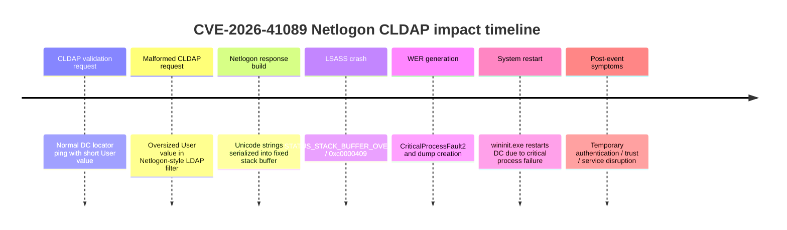

# CVE-2026-41089 - Netlogon

- [1. Technical overview](#1-technical-overview)
- [2. Summary table of artifacts](#2-summary-table-of-artifacts)
- [3. Non-volatile artifacts](#3-non-volatile-artifacts)
- [4. Volatile artifacts](#4-volatile-artifacts)
  - [4.1 OS Interaction artifacts](#41-os-interaction-artifacts)
  - [4.2 Network artifacts](#42-network-artifacts)
- [5. Detection rules and collection targets](#5-detection-rules-and-collection-targets)
- [6. References](#6-references)

## 1. Technical overview

High-level description of the CVE purpose, affected component, exploitation path and expected operating behavior.

| Section | Content |
|---------|---------|
| Description | [CVE-2026-41089](https://github.com/0xABCD01/CVE-2026-41089) is a critical fixed-size stack buffer vulnerability affecting **Windows Netlogon on Windows Domain Controllers**, addressed during Microsoft's May 2026 Patch Tuesday.<br><br>The vulnerability is triggered through the CLDAP (Connectionless LDAP) service over UDP/389, a protocol commonly used by Windows systems to locate Domain Controllers within an Active Directory environment.<br><br>The public proof-of-concept (PoC) sends a specially crafted LDAP SearchRequest containing a Netlogon-style filter with the attributes `DnsDomain`, an oversized attacker-controlled `User` value, and `NtVer` flags. During the generation of the CLDAP response, Netlogon attempts to serialize multiple Unicode strings into a fixed-size stack buffer. Improper length handling can result in memory corruption within the LSASS process.<br><br>In observed testing, exploitation results in an LSASS crash followed by an automatic Domain Controller restart, causing a denial-of-service (DoS) condition. Microsoft classifies the vulnerability as Remote Code Execution (RCE); however, the publicly available PoC and the laboratory validation performed during this research demonstrate service disruption through LSASS termination and system reboot. |
|Tactics & Techniques| TA0001 - Initial Access: T1190 - Exploit Public-Facing Application<br>TA0040 - Impact: T1499.004 - Endpoint DoS: Application or System Exploitation<br>TA0002 - Execution: T1203 - Exploitation for Client Execution (no confirmado)|
| Privileges | No valid domain or local credentials are required to send the CLDAP request, provided the attacker can reach UDP/389 on the Domain Controller. |
| OS | Victim: Windows Server running as an Active Directory Domain Controller. Public vulnerability references list Windows Server 2012 / 2012 R2, 2016, 2019, 2022, 2022 23H2 and 2025 as affected when unpatched. |
| Network | UDP/389 (CLDAP) |
| AV detection | No documented |

## 2. Summary table of artifacts

Overview table summarizing the main artifacts, where they reside and what information they contain.

Non-volatile artifacts:

| Source | Artifact | Indicator |
|------|----------|-----------|
| Application logs | `Application.evtx` | Event ID 1000 where `lsass.exe` is the faulting application and `netlogon.DLL` is the faulting module. Observed exception code: `0xc0000409`. |
| Application logs | `Application.evtx` | Event ID 1015 indicating that the critical system process `C:\Windows\system32\lsass.exe` failed and the machine must be restarted. |
| Windows Error Reporting | `%ProgramData%\Microsoft\Windows\WER\` | Event ID 1001 with `CriticalProcessFault2`, `P1: lsass.exe`, `P4: netlogon.DLL`, dump references such as `memory.hdmp` and `triagedump.dmp`. |
| System logs | `System.evtx` | Event ID 1074 indicating that `wininit.exe` initiated a restart because `C:\Windows\system32\lsass.exe` terminated unexpectedly. |
| System logs | `System.evtx` | Event ID 6008 indicating unexpected shutdown / unexpected restart. |
| System logs | `System.evtx` | Event ID 12 indicating startup after restart. |
| Netlogon / trust events | `System.evtx` | Event ID 5721 reporting a failed session setup to the Windows Domain Controller and referencing a long anomalous account/name derived from repeated `a...` / `b...` labels. |

Volatile artifacts:

| Source | Artifact | Indicator |
|------|----------|-----------|
| Active network telemetry | Network sensor / firewall / Zeek / packet capture | UDP traffic to Domain Controllers on port 389 using CLDAP. Suspicious requests may include Netlogon/DC locator-style LDAP filters with `DnsDomain`, `User` and `NtVer`. |
| Process state | Memory / EDR | LSASS process failure or abrupt termination with status `0xc0000409` / `STATUS_STACK_BUFFER_OVERRUN`. |
| Service availability | Monitoring / health checks | Temporary loss of response from the Domain Controller and/or UDP/389 after the malformed request. |
| Domain authentication | Authentication telemetry / DC health monitoring | Authentication disruption, trust setup errors or short-lived failed communication with the Domain Controller after LSASS crash/reboot. |

## 3. Non-volatile artifacts

CVE-2026-41089 does not require deployment of tooling on the victim host. The most relevant forensic evidence is generated by Windows itself when LSASS crashes and the Domain Controller restarts.

- `Application.evtx` Event ID 1000: faulting application `lsass.exe`, faulting module `netlogon.DLL`, exception code `0xc0000409`, fault offset `0x00000000000264fc`.
- `Application.evtx` Event ID 1015: critical system process `C:\Windows\system32\lsass.exe` failed with status code `c0000409`, requiring machine restart.
- `Application` / `Application - WER` Event ID 1001: `CriticalProcessFault2` for `lsass.exe` with `netlogon.DLL` and WER artifacts, including `memory.hdmp` and `triagedump.dmp` under `%ProgramData%\Microsoft\Windows\WER\ReportQueue\AppCrash_lsass.exe_*`.
- `System.evtx` Event ID 1074: `wininit.exe` initiated restart because `C:\Windows\system32\lsass.exe` terminated unexpectedly with status code `-1073740791`.
- `System.evtx` Event ID 6008: previous shutdown was unexpected.
- `System.evtx` Event ID 12: system startup after restart.
- `System.evtx` Event ID 5721: failed session setup to Domain Controller referencing an anomalous long account/domain-like value: `aaaaaaaaaaaaaaaaaaaaaaaaaaaaaaaaaaaaaaaaaaaaaaaaaaaaaaaaaaaaaaa.bbbbbbbbbbbbbbbbbbbbbbbbbbbbbb.local`.

## 4. Volatile artifacts

Evidence produced during exploitation and immediate post-exploitation impact, such as network activity, service failure, process termination and temporary authentication disruption.

### 4.1 OS Interaction artifacts

- LSASS terminates unexpectedly with status `0xc0000409` / `STATUS_STACK_BUFFER_OVERRUN`.
- Windows Error Reporting generates crash metadata and dump artifacts for `lsass.exe`.
- `wininit.exe` triggers a system restart because LSASS is a critical process.
- Domain Controller temporarily stops responding during crash/reboot window.
- Netlogon/trust-related errors can appear around the same time, including Event ID 5721.

### 4.2 Network artifacts

- CLDAP traffic to the Domain Controller over UDP/389.
- LDAP SearchRequest used as a DC locator / Netlogon query.
- Filter structure containing `DnsDomain`, oversized `User` value and `NtVer` flags.
- Potential request pattern:

```text
(&(DnsDomain=<target-domain>)(User=AAAA...AAAA)(NtVer=<flags>))
```

- If packet capture is available, review UDP/389 requests immediately preceding LSASS crash and system restart events.
- If Zeek or equivalent network metadata is available, pivot on spikes or anomalous clients sending CLDAP requests to Domain Controllers.

Example conceptual exploitation timeline:



## 5. Detection rules and collection targets

This section documents files, logs and rule ideas generated to enhance forensic analysis of CVE-2026-41089 exploitation attempts. These detections are designed to identify LSASS crash symptoms, Netlogon fault correlation and suspicious CLDAP traffic targeting Domain Controllers.

>[!Caution]
>The following rules are theoretical and have not been tested in practice yet.

YARA-L style event rule for LSASS / Netlogon crash evidence:

```yaml
rule CVE_2026_41089_LSASS_Netlogon_Crash
{
  meta:
    description = "Detects textual crash evidence consistent with CVE-2026-41089 Netlogon LSASS failure"
    author = "Blue Team"
    date = "2026-07-15"
    reference = "https://github.com/0xABCD01/CVE-2026-41089"
  strings:
    $lsass = "lsass.exe" nocase
    $netlogon = "netlogon.DLL" nocase
    $exception1 = "0xc0000409" nocase
    $exception2 = "c0000409" nocase
    $wer = "CriticalProcessFault2" nocase
  condition:
    $lsass and $netlogon and ($exception1 or $exception2 or $wer)
}
```

Suricata rule idea for suspicious CLDAP Netlogon-style request to a Domain Controller:

```suricata
alert udp any any -> $DC_SERVERS 389 (msg:"POSSIBLE CVE-2026-41089 Netlogon CLDAP suspicious User field"; content:"DnsDomain"; nocase; content:"User"; nocase; content:"NtVer"; nocase; threshold:type both, track by_src, count 1, seconds 60; classtype:attempted-dos; sid:4108901; rev:1;)
```

> [!Warning]
> The network rule above is intentionally generic. CLDAP/LDAP is BER-encoded and may not always expose strings in a simple ASCII-friendly way depending on sensor normalization. Prefer protocol-aware parsing where available, and validate with packet captures from controlled testing.

KQL hunting query idea for Windows event data:

```kql
Event
| where EventLog in ("Application", "System")
| where EventID in (1000, 1001, 1015, 1074, 6008, 12, 5721)
| where RenderedDescription has_any ("lsass.exe", "netlogon.DLL", "c0000409", "0xc0000409", "CriticalProcessFault2", "unexpectedly", "terminated unexpectedly")
| project TimeGenerated, Computer, EventLog, EventID, Source, RenderedDescription
| order by TimeGenerated asc
```

KQL correlation query idea for LSASS crash followed by restart:

```kql
let CrashWindow = 10m;
let LsassCrash = Event
| where EventLog == "Application"
| where EventID in (1000, 1001, 1015)
| where RenderedDescription has "lsass.exe"
| where RenderedDescription has_any ("netlogon.DLL", "c0000409", "0xc0000409", "CriticalProcessFault2")
| project CrashTime=TimeGenerated, Computer, CrashEventID=EventID, CrashDescription=RenderedDescription;
let Restart = Event
| where EventLog == "System"
| where EventID in (1074, 6008, 12)
| project RestartTime=TimeGenerated, Computer, RestartEventID=EventID, RestartDescription=RenderedDescription;
LsassCrash
| join kind=innerunique Restart on Computer
| where RestartTime between (CrashTime .. CrashTime + CrashWindow)
| project Computer, CrashTime, CrashEventID, RestartTime, RestartEventID, CrashDescription, RestartDescription
| order by CrashTime asc
```

## 6. References

1. [0xABCD01 - CVE-2026-41089 PoC](https://github.com/0xABCD01/CVE-2026-41089)
2. [NVD - CVE-2026-41089](https://nvd.nist.gov/vuln/detail/CVE-2026-41089)
3. [Microsoft Security Update Guide - CVE-2026-41089](https://msrc.microsoft.com/update-guide/vulnerability/CVE-2026-41089)
4. [Huskersec - CVE-2026-41089 Netlogon analysis](https://huskersec.com/posts/CVE-2026-41089-netlogon-analysis/)
5. [mirzadedic.ca - CVE-2026-41089 CLDAP detection](https://mirzadedic.ca/blog/cve-2026-41089-netlogon-cldap-detection/)
