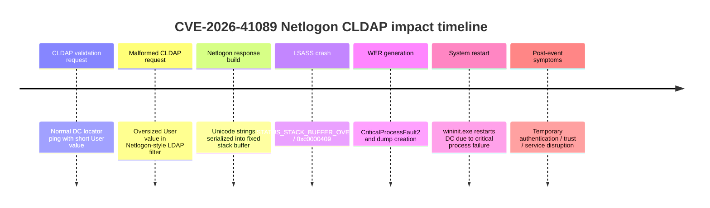

[CVE-2026-41089.md](https://github.com/user-attachments/files/30124507/CVE-2026-41089.md)
# CVE-2026-41089 - Netlogon

- [1. Technical overview](#1-technical-overview)
- [2. Summary table of artifacts](#2-summary-table-of-artifacts)
- [3. Non-volatile artifacts](#3-non-volatile-artifacts)
- [4. Volatile artifacts](#4-volatile-artifacts)
  - [4.1 OS Interaction artifacts](#41-os-interaction-artifacts)
  - [4.2 Network artifacts](#42-network-artifacts)
- [5. Detection rules and collection targets](#5-detection-rules-and-collection-targets)
- [6. References](#6-references)

## 1. Technical overview

High-level description of the CVE purpose, affected component, exploitation path and expected operating behavior.

| Section | Content |
|---------|---------|
| Description | [CVE-2026-41089](https://github.com/0xABCD01/CVE-2026-41089) is a critical fixed-size stack buffer vulnerability affecting Windows Netlogon on Windows Domain Controllers.<br><br>In observed testing, this produced an LSASS crash and a subsequent Domain Controller restart but this stack buffer can lead to a RCE under certain circumstances. |
|Tactics & Techniques| TA0001 - Initial Access: T1190 - Exploit Public-Facing Application<br>TA0040 - Impact: T1499.004 - Endpoint DoS: Application or System Exploitation<br>TA0002 - Execution: T1203 - Exploitation for Client Execution (no confirmado)|
| Privileges | No valid domain or local credentials are required to send the CLDAP request, provided the attacker can reach UDP/389 on the Domain Controller. |
| OS | Victim: Windows Server running as an Active Directory Domain Controller. Public vulnerability references list Windows Server 2012 / 2012 R2, 2016, 2019, 2022, 2022 23H2 and 2025 as affected when unpatched. |
| Network | UDP/389 (CLDAP) |
| AV detection | No documented |

## 2. Summary table of artifacts

Overview table summarizing the main artifacts, where they reside and what information they contain.

Non-volatile artifacts:

| Source | Artifact | Indicator |
|------|----------|-----------|
| Application logs | `Application.evtx` | Event ID 1000 where `lsass.exe` is the faulting application and `netlogon.DLL` is the faulting module. Observed exception code: `0xc0000409`. |
| Application logs | `Application.evtx` | Event ID 1015 indicating that the critical system process `C:\Windows\system32\lsass.exe` failed and the machine must be restarted. |
| Windows Error Reporting | `%ProgramData%\Microsoft\Windows\WER\` | Event ID 1001 with `CriticalProcessFault2`, `P1: lsass.exe`, `P4: netlogon.DLL`, dump references such as `memory.hdmp` and `triagedump.dmp`. |
| System logs | `System.evtx` | Event ID 1074 indicating that `wininit.exe` initiated a restart because `C:\Windows\system32\lsass.exe` terminated unexpectedly. |
| System logs | `System.evtx` | Event ID 6008 indicating unexpected shutdown / unexpected restart. |
| System logs | `System.evtx` | Event ID 12 indicating startup after restart. |
| Netlogon / trust events | `System.evtx` | Event ID 5721 reporting a failed session setup to the Windows Domain Controller and referencing a long anomalous account/name derived from repeated `a...` / `b...` labels. |

Volatile artifacts:

| Source | Artifact | Indicator |
|------|----------|-----------|
| Active network telemetry | Network sensor / firewall / Zeek / packet capture | UDP traffic to Domain Controllers on port 389 using CLDAP. Suspicious requests may include Netlogon/DC locator-style LDAP filters with `DnsDomain`, `User` and `NtVer`. |
| Process state | Memory / EDR | LSASS process failure or abrupt termination with status `0xc0000409` / `STATUS_STACK_BUFFER_OVERRUN`. |
| Service availability | Monitoring / health checks | Temporary loss of response from the Domain Controller and/or UDP/389 after the malformed request. |
| Domain authentication | Authentication telemetry / DC health monitoring | Authentication disruption, trust setup errors or short-lived failed communication with the Domain Controller after LSASS crash/reboot. |

## 3. Non-volatile artifacts

CVE-2026-41089 does not require deployment of tooling on the victim host. The most relevant forensic evidence is generated by Windows itself when LSASS crashes and the Domain Controller restarts.

- `Application.evtx` Event ID 1000: faulting application `lsass.exe`, faulting module `netlogon.DLL`, exception code `0xc0000409`, fault offset `0x00000000000264fc`.
- `Application.evtx` Event ID 1015: critical system process `C:\Windows\system32\lsass.exe` failed with status code `c0000409`, requiring machine restart.
- `Application` / `Application - WER` Event ID 1001: `CriticalProcessFault2` for `lsass.exe` with `netlogon.DLL` and WER artifacts, including `memory.hdmp` and `triagedump.dmp` under `%ProgramData%\Microsoft\Windows\WER\ReportQueue\AppCrash_lsass.exe_*`.
- `System.evtx` Event ID 1074: `wininit.exe` initiated restart because `C:\Windows\system32\lsass.exe` terminated unexpectedly with status code `-1073740791`.
- `System.evtx` Event ID 6008: previous shutdown was unexpected.
- `System.evtx` Event ID 12: system startup after restart.
- `System.evtx` Event ID 5721: failed session setup to Domain Controller referencing an anomalous long account/domain-like value: `aaaaaaaaaaaaaaaaaaaaaaaaaaaaaaaaaaaaaaaaaaaaaaaaaaaaaaaaaaaaaaa.bbbbbbbbbbbbbbbbbbbbbbbbbbbbbb.local`.

## 4. Volatile artifacts

Evidence produced during exploitation and immediate post-exploitation impact, such as network activity, service failure, process termination and temporary authentication disruption.

### 4.1 OS Interaction artifacts

- LSASS terminates unexpectedly with status `0xc0000409` / `STATUS_STACK_BUFFER_OVERRUN`.
- Windows Error Reporting generates crash metadata and dump artifacts for `lsass.exe`.
- `wininit.exe` triggers a system restart because LSASS is a critical process.
- Domain Controller temporarily stops responding during crash/reboot window.
- Netlogon/trust-related errors can appear around the same time, including Event ID 5721.

### 4.2 Network artifacts

- CLDAP traffic to the Domain Controller over UDP/389.
- LDAP SearchRequest used as a DC locator / Netlogon query.
- Filter structure containing `DnsDomain`, oversized `User` value and `NtVer` flags.
- Potential request pattern:

```text
(&(DnsDomain=<target-domain>)(User=AAAA...AAAA)(NtVer=<flags>))
```

- If packet capture is available, review UDP/389 requests immediately preceding LSASS crash and system restart events.
- If Zeek or equivalent network metadata is available, pivot on spikes or anomalous clients sending CLDAP requests to Domain Controllers.

Example conceptual exploitation timeline:



## 5. Detection rules and collection targets

This section documents files, logs and rule ideas generated to enhance forensic analysis of CVE-2026-41089 exploitation attempts. These detections are designed to identify LSASS crash symptoms, Netlogon fault correlation and suspicious CLDAP traffic targeting Domain Controllers.

>[!Caution]
>The following rules are theoretical and have not been tested in practice yet.

Host-based SIGMA rule for LSASS crash involving Netlogon:

```yaml
title: LSASS Crash Involving Netlogon DLL - Possible CVE-2026-41089
id: 7a4d5a5c-4108-49b0-9f89-netlogon-lsass-crash
status: experimental
description: Detects Application Error events where lsass.exe crashes with netlogon.DLL as the faulting module, a key symptom observed during CVE-2026-41089 testing.
author: Blue Team
date: 2026-07-15
references:
  - https://github.com/0xABCD01/CVE-2026-41089
  - https://nvd.nist.gov/vuln/detail/CVE-2026-41089
logsource:
  product: windows
  service: application
detection:
  selection_event:
    EventID: 1000
  selection_app:
    Data|contains: 'lsass.exe'
  selection_module:
    Data|contains: 'netlogon.DLL'
  selection_exception:
    Data|contains:
      - '0xc0000409'
      - 'c0000409'
  condition: selection_event and selection_app and selection_module and selection_exception
fields:
  - Computer
  - EventID
  - Provider_Name
  - Data
falsepositives:
  - LSASS crashes caused by other Netlogon faults or third-party security products. Investigate and correlate with UDP/389 CLDAP traffic.
level: high
```

Host-based SIGMA rule for critical LSASS failure and forced restart:

```yaml
title: Critical LSASS Failure Followed By System Restart
id: cve-2026-41089-lsass-critical-restart
status: experimental
description: Detects critical LSASS failure and system restart patterns observed after CVE-2026-41089 exploitation attempts.
author: Blue Team
date: 2026-07-15
references:
  - https://github.com/0xABCD01/CVE-2026-41089
logsource:
  product: windows
detection:
  app_lsass_critical:
    Channel: Application
    EventID: 1015
    Data|contains:
      - 'lsass.exe'
      - 'c0000409'
  system_restart_lsass:
    Channel: System
    EventID: 1074
    Data|contains:
      - 'wininit.exe'
      - 'lsass.exe'
  condition: app_lsass_critical or system_restart_lsass
fields:
  - Computer
  - EventID
  - Channel
  - Data
falsepositives:
  - Rare legitimate LSASS crashes. Treat as high priority on Domain Controllers.
level: high
```

Host-based SIGMA rule for WER CriticalProcessFault2 involving LSASS and Netlogon:

```yaml
title: WER CriticalProcessFault2 for LSASS and Netlogon DLL
id: cve-2026-41089-wer-criticalprocessfault2
status: experimental
description: Detects Windows Error Reporting records generated after LSASS crash with netlogon.DLL as the related module.
author: Blue Team
date: 2026-07-15
references:
  - https://github.com/0xABCD01/CVE-2026-41089
logsource:
  product: windows
  service: application
detection:
  selection:
    EventID: 1001
    Data|contains|all:
      - 'CriticalProcessFault2'
      - 'lsass.exe'
      - 'netlogon.DLL'
  condition: selection
fields:
  - Computer
  - EventID
  - Provider_Name
  - Data
falsepositives:
  - Other LSASS/Netlogon crash conditions.
level: high
```

## 6. References

1. [0xABCD01 - CVE-2026-41089 PoC](https://github.com/0xABCD01/CVE-2026-41089)
2. [NVD - CVE-2026-41089](https://nvd.nist.gov/vuln/detail/CVE-2026-41089)
3. [Microsoft Security Update Guide - CVE-2026-41089](https://msrc.microsoft.com/update-guide/vulnerability/CVE-2026-41089)
4. [Huskersec - CVE-2026-41089 Netlogon analysis](https://huskersec.com/posts/CVE-2026-41089-netlogon-analysis/)
5. [mirzadedic.ca - CVE-2026-41089 CLDAP detection](https://mirzadedic.ca/blog/cve-2026-41089-netlogon-cldap-detection/)
