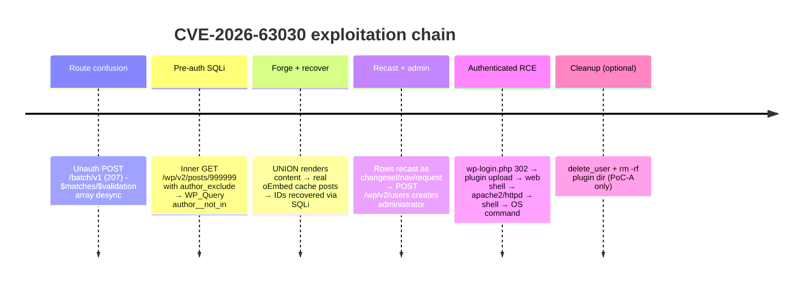

# CVE-2026-63030 - WordPress REST `batch/v1` (SQLi → RCE)

- [1. Technical overview](#1-technical-overview)
- [2. Summary table of artifacts](#2-summary-table-of-artifacts)
- [3. Non-volatile artifacts](#3-non-volatile-artifacts)
  - [3.1 Web server access log](#31-web-server-access-log)
  - [3.2 PHP error log](#32-php-error-log)
  - [3.3 WordPress debug.log](#33-wordpress-debuglog)
  - [3.4 MySQL query log](#34-mysql-query-log)
  - [3.5 WordPress database rows](#35-wordpress-database-rows)
  - [3.6 Filesystem residue](#36-filesystem-residue)
- [4. Volatile artifacts](#4-volatile-artifacts)
  - [4.1 OS Interaction artifacts](#41-os-interaction-artifacts)
  - [4.2 Network artifacts](#42-network-artifacts)
- [5. Detection rules and collection targets](#5-detection-rules-and-collection-targets)
- [6. References](#6-references)

## 1. Technical overview

High-level description of the CVE purpose, affected component, exploitation path and expected operating behavior.

| Section | Content |
|---------|---------|
| Description | [CVE-2026-63030](https://nvd.nist.gov/vuln/detail/CVE-2026-63030) is an **unauthenticated SQL injection in the WordPress core REST API**, reachable through the batch endpoint `WP_REST_Server::serve_batch_request_v1()` (`wp-includes/rest-api/class-wp-rest-server.php`) and chained to remote code execution.<br><br>The batch endpoint runs several sub-requests in one call and relies on each being validated and permission-checked on its own. Internally it builds two parallel arrays - `$matches` (matched handler per sub-request) and `$validation` (validation result per sub-request) - and indexes both by the same offset when dispatching. A sub-request whose path fails `wp_parse_url()` is appended to `$validation` but **not** to `$matches`, so the arrays fall out of step and a sub-request is dispatched under a *different* sub-request's handler. This **route confusion** bypasses the method allow-list and schema validation, letting a crafted item-route request (`GET /wp/v2/posts/999999` carrying `author_exclude`/`orderby`/`per_page`) reach `WP_Query`'s `author__not_in` var, which the vulnerable build interpolates into SQL as a string - a **pre-authentication boolean/time-blind and UNION SQL injection**.<br><br>The public PoCs chain the injection to RCE: UNION-render attacker content to force real oEmbed cache posts, recover their IDs via the SQLi, recast them as a customizer changeset / navigation item / request hook, drive `POST /wp/v2/users` to create a **generated administrator**, then log in and use admin **plugin upload** to drop a PHP web shell and run commands. Steps up to admin creation are pre-auth; command execution is authenticated admin plugin upload using the account the exploit itself created.<br><br>Lab-confirmed vulnerable: WordPress `6.9.4` and `7.0.1`; **fixed in `7.0.2` and `6.9.5`** (WordPress security advisory [GHSA-ff9f-jf42-662q](https://github.com/WordPress/wordpress-develop/security/advisories/GHSA-ff9f-jf42-662q)). The unauthenticated batch route is exploitable on 6.9+; on 6.8.x the batch route is not reachable and only the sibling read-only injection CVE-2026-60137 applies. Confirm the authoritative affected-version range and CVSS against NVD/GHSA. |
| Tactics & Techniques | TA0001 - Initial Access: T1190 - Exploit Public-Facing Application<br>TA0001 / TA0003 - Valid Accounts: T1078 (exploit creates a generated administrator)<br>TA0003 - Persistence: T1505.003 - Server Software Component: Web Shell<br>TA0002 - Execution: T1059.004 - Unix Shell / T1059.003 - Windows Command Shell (web shell → OS command)<br>TA0005 - Defense Evasion: T1070.004 - File Deletion, T1070.009 - Clear Persistence, T1070.006 - Timestomp |
| Privileges | **None.** No valid WordPress or OS credentials are required - the SQLi and administrator creation are unauthenticated. The command-execution step authenticates as the administrator the exploit itself creates, so no attacker-supplied credentials are needed at any stage. Only network reach to the site is required. |
| OS | OS-independent (any WordPress host). Validated on Linux/Apache with `mod_php` (Docker `wordpress:7.0.1` / `6.9.4`) and corroborated on Windows + XAMPP. Vulnerability is in WordPress core, not the OS. |
| Network | HTTP/HTTPS to the WordPress site. Trigger: `POST /?rest_route=/batch/v1` (also reachable as `POST /wp-json/batch/v1`), answered **HTTP 207 Multi-Status**. Web shell: `GET /wp-content/plugins/wp2shell_<8hex>/wp2shell_<8hex>.php?t=<32hex>&c=<cmd>`. (Lab ports `8081`/`8082`.) |
| AV detection | No documented signatures. |

## 2. Summary table of artifacts

Overview table summarizing the main artifacts, where they reside and what information they contain.

Non-volatile artifacts:

| Source | Artifact | Indicator |
|------|----------|-----------|
| Web server access log | `access.log` | Unauthenticated `POST …/batch/v1` → **207** in a burst (≥8), then `POST /wp-login.php` → **302** with no preceding failed login, then `plugin-install.php?tab=upload` → `update.php?action=upload-plugin`, then a hit on `/wp-content/plugins/wp2shell_<8hex>/wp2shell_<8hex>.php?t=<32hex>&c=<cmd>`. |
| Apache error log (PHP) | `error.log` | PHP warning pair `Undefined array key` + `Trying to access array offset on null` in `class-wp-rest-server.php` (same second); one `WordPress database error … UNION ALL SELECT …` with `serve_batch_request_v1` in the stack trace. |
| WordPress debug log | `wp-content/debug.log` | The same `class-wp-rest-server.php` warning pair at its canonical on-disk path (only if `WP_DEBUG_LOG` is enabled). |
| MySQL query log | `mysql.general_log` / `slow_log` | The injected query verbatim: `wp_posts … post_author NOT IN (1) … UNION ALL SELECT …0x323032302d…` (only if DB query logging is enabled). |
| WordPress DB - `wp_posts` | SQL dump | `customize_changeset` and `request` (`post_name='parse'`) rows with `post_date='2020-01-01 00:00:00'` (hardcoded timestomp); plus `oembed_cache` / `Auto Draft` / `wp_navigation` rows. Survive attacker cleanup. |
| WordPress DB - `wp_options` | SQL dump | `_site_transient_browser_<md5>` whose value contains `"name";s:7:"unknown"` - the attacker's User-Agent cached, unrecognised as a browser. |
| WordPress DB - `wp_users`/`wp_usermeta` | SQL dump | Rogue administrator `wp2_<12hex>`, email `…@wp2shell.invalid`, `administrator` caps (present only if the attacker did not clean up). |
| Filesystem | `wp-content/upgrade/`, `wp-content/plugins/` | Empty `upgrade/` staging dir on a site with no admin-installed plugins; `plugins/` directory mtime newer than every child - the footprint of a created-and-deleted web shell. |

Volatile artifacts:

| Source | Artifact | Indicator |
|------|----------|-----------|
| Process creation telemetry | Sysmon EID 1 / Sysmon-for-Linux / auditd `execve` / ProcMon | Web-server worker (`apache2` / `httpd.exe` / `php-fpm`) spawning a shell (`dash`/`sh` / `cmd.exe`) then an OS command (`id`/`whoami`/`rm`) as the web-server user - including the attacker's `rm -rf` self-cleanup. |
| Network | Web server / IDS / packet capture | `207 Multi-Status` on `batch/v1` from an unauthenticated source. |
| Request bodies (SQLi payload) | pcap / body-logging proxy / mod_security | The raw `POST …/batch/v1` JSON body carrying the injection - recoverable only with body capture. |

## 3. Non-volatile artifacts

CVE-2026-63030 deploys no tooling to the OS; the durable evidence is in the web server logs, the WordPress database, and filesystem timestamps. Unless stated otherwise, every indicator below was verified absent from clean baselines **and** absent from a patched (7.0.2) host under the same attack - i.e. they are **successful-exploitation** indicators.

### 3.1 Web server access log

The full request chain is invariant across two independent PoCs and two WordPress versions. Redacted sample (WordPress v7.0.1, UTC):

```text
14:47:46 "POST /?rest_route=/batch/v1 HTTP/1.1" 207 8743 "-" "wp2shell"
14:47:47 "GET  /?rest_route=%2Fwp%2Fv2%2Fposts&per_page=1&_fields=link HTTP/1.1" 200 610
14:47:47 "POST /?rest_route=/batch/v1 HTTP/1.1" 207 8931   (x7)
14:47:48 "POST /wp-login.php HTTP/1.1" 302 1265
14:47:48 "GET  /wp-admin/ HTTP/1.1" 200 129033
14:47:51 "GET  /wp-admin/plugin-install.php?tab=upload HTTP/1.1" 200 90039
14:47:51 "POST /wp-admin/update.php?action=upload-plugin HTTP/1.1" 200 83101
14:47:52 "GET  /wp-content/plugins/wp2shell_9826b4c0/wp2shell_9826b4c0.php?t=85ea18cfd86d00966a9f3a1482dd2940&c=pwd" 200 259
```

> **Key value:** the pre-auth SQLi rides *inside* the `batch/v1` POST **bodies**, which are not logged, so the injection itself shows in the access log only as the repeated **207** burst plus one read-back `GET …/wp/v2/posts…_fields=link`. The pre-auth → authenticated boundary is the `wp-login.php` **302 with no preceding failed login**. A *single* `batch/v1` 207 is benign REST usage (it fires once even on a patched host) - only the **≥8 burst plus the follow-on chain** is distinctive. The web-shell User-Agent is *not* invariant (PoC-A uses `wp2shell`, PoC-B spoofs Chrome).

**What to look for?**
- A burst of ≥8 unauthenticated `POST /?rest_route=/batch/v1` (or `/wp-json/batch/v1`) answered **207** from one source in a short window.
- A `POST /wp-login.php` → **302** from that source with **no** preceding 401/failed login, followed within seconds by `plugin-install.php?tab=upload` and `update.php?action=upload-plugin`.
- Any `GET` to `/wp-content/plugins/wp2shell_<8hex>/wp2shell_<8hex>.php?t=<32hex>&c=<cmd>`.

### 3.2 PHP error log

The route confusion and the resulting injection surface in `error.log`. Redacted sample (WordPress v7.0.1):

```text
[php:warn] [client 172.19.0.1] PHP Warning: Undefined array key 2 in
  /var/www/html/wp-includes/rest-api/class-wp-rest-server.php on line 1836
[php:warn] [client 172.19.0.1] PHP Warning: Trying to access array offset on null in
  /var/www/html/wp-includes/rest-api/class-wp-rest-server.php on line 1848

[php:notice] [client 172.19.0.1] WordPress database error You have an error in your SQL syntax; ...
 for query SELECT SQL_CALC_FOUND_ROWS wp_posts.* FROM wp_posts
   WHERE 1=1 AND wp_posts.post_author NOT IN (1) AND 1=0
   UNION ALL SELECT 0,1,0x323032302d30312d30312030303a30303a3030, ... -- -)
 made by ... WP_REST_Server->serve_request, WP_REST_Server->dispatch,
 WP_REST_Server->serve_batch_request_v1, WP_REST_Server->respond_to_request,
 WP_REST_Posts_Controller->get_items, WP_Query->query
```

> **Key value:** the `Undefined array key` / `Trying to access array offset on null` pair in `class-wp-rest-server.php` **is** the `$matches`/`$validation` array desync - the route-confusion primitive itself. The `WordPress database error … UNION ALL SELECT …` line with `serve_batch_request_v1` **twice** in the stack trace is the injection reaching `WP_Query`. Both fire only on **successful** injection - a patched host produces neither. The message + file are constant, but **line numbers shift with the WordPress version** (1836/1848 on 7.0.1, 1841/1853 on 6.9.4) - never match on line numbers. The SQL-error line exists only because this payload is syntactically invalid; the DB query log (§3.4) captures the injection regardless.

**What to look for?**
- The `Undefined array key` **and** `Trying to access array offset on null` warnings in `.../wp-includes/rest-api/class-wp-rest-server.php` within the same second.
- Any `WordPress database error` whose text contains `UNION ALL SELECT` and `serve_batch_request_v1` in the "made by" call chain.
- The hex constant `0x323032302d30312d30312030303a30303a3030` (= `2020-01-01 00:00:00`), the payload's hardcoded timestamp.

### 3.3 WordPress debug.log

When `WP_DEBUG` **and** `WP_DEBUG_LOG` are enabled, the same warning pair lands at the canonical on-disk path `wp-content/debug.log` (message counts observed 15/8/1/1, identical to §3.2):

```text
15  PHP Warning: Undefined array key 2 in wp-includes/rest-api/class-wp-rest-server.php
 8  PHP Warning: Trying to access array offset on null in wp-includes/rest-api/class-wp-rest-server.php
 1  PHP Warning: Undefined array key 4 in wp-includes/rest-api/class-wp-rest-server.php
 1  PHP Warning: Constant REST_REQUEST already defined in wp-includes/rest-api.php
```

**What to look for?**
- `wp-content/debug.log` containing the `class-wp-rest-server.php` `Undefined array key` / `array offset on null` pair.

### 3.4 MySQL query log

If MySQL `general_log` / `slow_log` is enabled (`log_output=TABLE`), the injected query is recorded verbatim - the highest-fidelity DB-tier evidence:

```text
... WHERE 1=1 AND wp_posts.post_author NOT IN (1) AND 1=0
    UNION ALL SELECT 0,1,0x323032302d30312d30312030303a30303a3030,0x323032302d…, … -- -
```

> **Key value:** unlike the §3.2 SQL error, the query log captures the injection **whether or not** the payload errors - so it survives a syntactically-valid future payload. On a patched host the same log positively shows the malicious query never reaches the database. **Caveat:** `general_log`/`log_output=TABLE` is off by default and high-volume - realistically present only where DBA logging was already enabled.

**What to look for?**
- `mysql.general_log`/`slow_log` rows against `wp_posts` containing `post_author NOT IN` and `UNION ALL SELECT`.

### 3.5 WordPress database rows

The injection writes rows that survive the attacker's cleanup - the most durable evidence when the web shell and rogue account are removed.

- **`wp_posts` (timestomp):** exploited runs add `customize_changeset` and `request` (`post_name='parse'`) rows with `post_date='2020-01-01 00:00:00'`, plus `oembed_cache` / `Auto Draft` / `wp_navigation` rows. The `2020-01-01 00:00:00` value is **hardcoded in the payload** (the plaintext of the `0x323032302d…` blob in §3.2).
- **`wp_options` (attacker UA):** `_site_transient_browser_<md5(User-Agent)>` caches WordPress's browser detection of the attacker's UA. A stored value of `"name";s:7:"unknown"` means the UA was not recognised as a browser - i.e. an automated tool logged into wp-admin. The MD5 can be brute-forced against a candidate UA list.
- **`wp_users`/`wp_usermeta` (rogue admin):** a `wp2_<12hex>` account with email `…@wp2shell.invalid` and `administrator` caps - present only in the non-cleaning PoC (PoC-A deletes the account and its usermeta with `delete_user=…&reassign=1`).

> **Key value:** two `wp_posts` rows dated `2020-01-01 00:00:00` on a site created in 2026 is a timestomping artifact with essentially no benign explanation, present in **all** exploited runs including the cleaned ones. The `wp_options` transients *other than* `_site_transient_browser_<md5>` are ordinary wp-admin-login noise (identical key set on a patched host) - do not treat them as indicators.

**What to look for?**
- `wp_posts` with `post_type='customize_changeset'` **and** `post_date='2020-01-01 00:00:00'`, or `post_type='request'` with `post_name='parse'`.
- `wp_options.option_name LIKE '_site_transient_browser_%'` whose value contains `"name";s:7:"unknown"`.
- `wp_users` login matching `wp2_[0-9a-f]{12}` / email `…@wp2shell.invalid` with administrator capabilities.

### 3.6 Filesystem residue

Even after the web shell is deleted, plugin-upload timestamps remain (bodyfile MACB; local `+0200`, subtract 2h for UTC):

```text
wp-content/upgrade   drwxr-xr-x uid=33  m=16:47:51 c=16:47:51 b=16:47:51   (= 14:47:51 UTC, the upload-plugin request)
wp-content/plugins   drwxr-xr-x uid=33  m=16:48:17 b=16:26:54            (mtime = the rm -rf; btime = original)
```

> **Key value:** an empty `wp-content/upgrade/` on a site where no plugin was ever installed through the admin UI dates the plugin-upload event; a `wp-content/plugins/` mtime *newer than every one of its children* proves a plugin directory was created and deleted - the surviving footprint of a wiped web shell. Note `upgrade/` is also created by any legitimate dashboard plugin/theme upload.

**What to look for?**
- Empty `wp-content/upgrade/` on a site with no admin-installed plugins.
- `wp-content/plugins/` directory mtime newer than all of its child entries.
- `wp-content/plugins/wp2shell_<8hex>/wp2shell_<8hex>.php` (uncleaned runs only).

## 4. Volatile artifacts

Evidence produced during exploitation and immediate post-exploitation that does not persist on disk on its own.

### 4.1 OS Interaction artifacts

- **No crash artifact.** Unlike a memory-corruption CVE, exploitation produces no core dump, segfault, or process crash.
- **Web-shell process lineage.** When the web shell runs an OS command, the web-server worker spawns a shell that spawns the command - captured by process-creation telemetry (Sysmon EID 1 / Sysmon-for-Linux / auditd `execve` / ProcMon). Observed on both platforms:

```text
Windows / XAMPP (ProcMon):        Linux / Apache mod_php (Sysmon for Linux, EID 1):
httpd.exe                         apache2 worker (www-data)
└── cmd.exe                       ├── /usr/bin/dash  «sh -c -- id …»
    └── whoami.exe                │   └── /usr/bin/id  «id»
                                  └── /usr/bin/dash  «sh -c -- … rm -rf "$d" …»
                                      └── /usr/bin/rm  «rm -rf …/wp2shell_<hex>»
```

> **Key value:** the `web-server-worker → shell → OS-command` lineage (`apache2`/`httpd.exe` → `dash`/`cmd.exe` → `id`/`whoami`/`rm`) is the canonical, CVE-independent signature of web-shell RCE - a web server hardly has a legitimate reason to spawn a command interpreter. With execve telemetry enabled it even records the attacker's `rm -rf` self-cleanup as an explicit process event (the plugin-directory deletion that §3.6 could otherwise only infer from mtime).

### 4.2 Network artifacts

- `207 Multi-Status` responses to `POST …/batch/v1` from an unauthenticated source - benign REST batch usage returns 207 too, so the **burst** (≥8) plus the follow-on chain is what matters.
- The SQLi payload travels in the `POST …/batch/v1` **request body** and is **not** in any standard log - only recoverable via packet capture, a body-logging reverse proxy, or mod_security. This is the only way to detect *attempts* against a patched host.



## 5. Detection rules and collection targets

This section documents the rules and collection targets generated to hunt CVE-2026-63030 exploitation. They target the successful-exploitation footprint (log warning pair + SQL error, injected DB rows, and the web-shell URI).

> [!Caution]
> These rules are drafted from lab evidence only and have not been validated against production traffic. Every error-log/DB rule fires on **successful** injection - a patched host under the same attack produces none of them; to catch *attempts* you must inspect the `POST …/batch/v1` request body (not captured in this lab). Additionaly, we do recommend to monitor them for false-positives or excesive noise when in production.

Sigma rules (`Outputs/sigmas/`):

- [`wp_cve_2026_63030_rest_batch_error.yml`](../Outputs/sigmas/wp_cve_2026_63030_rest_batch_error.yml) - the PHP warning pair + SQL error in the error log (§3.2).
- [`wp_cve_2026_63030_webshell_uri.yml`](../Outputs/sigmas/wp_cve_2026_63030_webshell_uri.yml) - access to the `wp2shell_<8hex>` web-shell URI with the `t=<32hex>` token (§3.1). Note that this rule is PoC specific, not a canonical IoC.

Collection target (`Outputs/uac/`):

- [`wordpress-webroot.yaml`](../Outputs/uac/wordpress-webroot.yaml) - UAC artifact to collect the WordPress webroot PHP files and plugin directories on a Linux victim.

Behavioural correlation:

```text
POST *rest_route=/batch/v1 OR *wp-json/batch/v1  status=207   (count >= 8, same src, 60s)
  followed within 120s by  POST /wp-login.php status=302 from the same src (no preceding failed login)
  followed within 120s by  POST /wp-admin/update.php?action=upload-plugin
```

Database hunting queries:

```sql
-- wp2shell PoC IoC: 'parse' and 2020-01-01 are HARDCODED payload constants, so this is
-- high-confidence for PoC-A/PoC-B but NOT CVE-generic - a bespoke exploit changes them.
-- Each clause is bound to its post_type so the bare date can't match an unrelated backdated post.
SELECT ID, post_type, post_name, post_date, post_modified
FROM wp_posts
WHERE (post_type = 'customize_changeset' AND post_date = '2020-01-01 00:00:00')
   OR (post_type = 'request'             AND post_name = 'parse' AND post_date = '2020-01-01 00:00:00');

-- attacker User-Agent cached as md5; non-browser agents reaching wp-admin
-- caveat one must hash a list of well-known UA to compare against
SELECT option_name, option_value
FROM wp_options
WHERE option_name LIKE '\_site\_transient\_browser\_%'
  AND option_value LIKE '%"name";s:7:"unknown"%';

-- rogue administrators (only if the attacker did not clean up)
SELECT u.ID, u.user_login, u.user_email, u.user_registered
FROM wp_users u JOIN wp_usermeta m ON m.user_id = u.ID
WHERE m.meta_key LIKE '%capabilities' AND m.meta_value LIKE '%administrator%';

-- DB-tier ground truth of the injection, IF general_log/log_output=TABLE was enabled
SELECT event_time, LEFT(argument, 500)
FROM mysql.general_log
WHERE argument LIKE '%wp_posts%'
  AND argument LIKE '%UNION ALL SELECT%'
  AND argument LIKE '%post_author NOT IN%';
```

Filesystem triage:

```bash
# empty upgrade dir = a plugin was uploaded through the dashboard
find /var/www/html/wp-content/upgrade -maxdepth 0 -empty
# any PHP under a plugin dir matching the tool's pattern
find /var/www/html/wp-content/plugins -regextype posix-extended -regex '.*/wp2shell_[0-9a-f]{8}/.*\.php'
```

**Rule limitations**

- PHP warning line numbers are **version-bound** - match on file + message, never line number.
- User-Agent matching is already evaded by a second public PoC; the `wp2shell_` naming is tool-specific (a different dropper defeats the URI rule - the error-log and DB rules do not depend on it).
- Web-shell file hashes are useless (per-run random token).
- The `wp_posts` timestomp/marker rows (`post_date = 2020-01-01 00:00:00`, `post_name = 'parse'`) are **payload constants** of these PoCs, not CVE-inherent - a bespoke exploit of the same flaw would change them. Treat query as a high-confidence wp2shell IoC; for technique-level detection independent of the tool, rely on the error-log warning pair (§3.2) and the `general_log` UNION (§3.4) as a generic timestomp sweep.
- Nothing here detects the exploit when PHP `log_errors` is off - verify it is on.

## 6. References

1. [PoC-A - Icex0/wp2shell-poc](https://github.com/Icex0/wp2shell-poc/tree/dc6d45638259b53e8315c8c984350d67edb184f9) (self-cleanup, UA `wp2shell`)
2. [PoC-B - 0xsha/wp2shell](https://github.com/0xsha/wp2shell/tree/c51d6d04e6408ce513b6bb6fe582b2d51601927c) (UA spoofing, no cleanup)
3. [NVD - CVE-2026-63030](https://nvd.nist.gov/vuln/detail/CVE-2026-63030)
4. [WordPress security advisory - GHSA-ff9f-jf42-662q](https://github.com/WordPress/wordpress-develop/security/advisories/GHSA-ff9f-jf42-662q) (fixed in 7.0.2)
5. [MITRE ATT&CK - T1190 Exploit Public-Facing Application](https://attack.mitre.org/techniques/T1190/)
6. [MITRE ATT&CK - T1078 Valid Accounts](https://attack.mitre.org/techniques/T1078/)
7. [MITRE ATT&CK - T1505.003 Web Shell](https://attack.mitre.org/techniques/T1505/003/)
8. [MITRE ATT&CK - T1059.004 Unix Shell](https://attack.mitre.org/techniques/T1059/004/) · [T1059.003 Windows Command Shell](https://attack.mitre.org/techniques/T1059/003/)
9. [MITRE ATT&CK - T1070.004 File Deletion](https://attack.mitre.org/techniques/T1070/004/) · [T1070.006 Timestomp](https://attack.mitre.org/techniques/T1070/006/) · [T1070.009 Clear Persistence](https://attack.mitre.org/techniques/T1070/009/)
