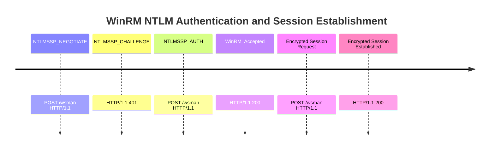

# evil-winrm

- [evil-winrm](#evil-winrm)
  - [1. Technical overview](#1-technical-overview)
  - [2. Summary table of artifacts](#2-summary-table-of-artifacts)
  - [3. Non-volatile artifacts](#3-non-volatile-artifacts)
  - [4. Volatile artifacts](#4-volatile-artifacts)
    - [4.a OS Interaction artifacts](#4a-os-interaction-artifacts)
    - [4.b  Network artifacts](#4b--network-artifacts)
  - [5. Detection rules and collection targets](#5-detection-rules-and-collection-targets)
    - [SIGMA rules](#sigma-rules)
    - [Other rules](#other-rules)
  - [6. References](#6-references)

## 1. Technical overview

High‑level description of the tool’s purpose, functionality, and operating behavior.

| Section | Content |
|---------|---------|
| Description | [GitHub - Hackplayers/evil-winrm](https://github.com/Hackplayers/evil-winrm) <br><br>Evil‑WinRM is an offensive post‑exploitation tool written in Ruby designed to interact with Windows Remote Management (WinRM) services. It provides attackers with an interactive PowerShell session over WinRM, supporting authentication via NTLM, Kerberos, plaintext credentials, or NTLM pass‑the‑hash. The tool is commonly used after initial access to remotely execute commands, upload/download files, and perform privilege escalation and lateral movement. |
| Tactics & Techniques | TA0002 – Execution <br>• T1059.001 – PowerShell <br><br>TA0005 – Defense Evasion  <br>• T1070.004 – File Deletion (cleanup after execution)  <br>• T1562.001 – Disable or Modify Tools (AMSI bypasses executed via PowerShell) <br><br>TA0006 – Credential Access  <br>• T1550.002 – Pass the Hash <br><br>TA0008 – Lateral Movement<br>• T1021.006 – WinRM <br><br>TA0011 – Command and Control<br>• T1071.001 – Web Protocols (HTTP/HTTPS over WinRM)|
| Privileges | Depends on supplied credentials; typically requires valid domain or local user credentials |
| OS | • Attacker: Linux / macOS (Ruby)  <br>• Victim: Windows (WinRM enabled) |
| Network |• TCP/5985 (HTTP WinRM)  <br>• TCP/5986 (HTTPS WinRM) |
| AV detection | Pending |


## 2. Summary table of artifacts

Overview table summarizing the main artifacts, where they reside and what information they contain.

Non-volatile artifacts:


| Source | Artifact | Indicator |
|------|----------|-----------|
| Process execution | `%SystemRoot%\Prefetch`  <br>`%SystemRoot%\System32\config\SYSTEM`  <br>`%SystemRoot%\AppCompat\Programs\Amcache.hve` | • Prefetch for powershell.exe / wsmprovhost.exe  <br>• Amcache execution metadata |
| PowerShell logging | `Microsoft-Windows-PowerShell/Operational` | • Event ID 4104 (ScriptBlock)  <br>• Event ID 4103 (Module Logging) |
| WinRM logs | `Microsoft-Windows-WinRM/Operational.evtx` | • Event IDs 6, 91, 169 |
| HTTP.sys logs | `Microsoft-Windows-HTTPService/Operational.evtx` | • POST requests to `/wsman` <br>• Content-type: `application/soap`<br>• UserAgent: `Ruby WinRM Client` |
| Security logs | `Security.evtx` | • 4624 (Logon Type 3)  <br>• 4688 (Process Creation) |
| Error reporting | `%ProgramData%\Microsoft\Windows\WER` | • PowerShell / provider crash logs |


Volatile artifacts:

| Source | Artifact | Indicator |
|------|----------|-----------|
| Active processes | Memory / EDR | • `wsmprovhost.exe`  <br>• `powershell.exe` |
| Loaded modules | Memory dump | • `System.Management.Automation.dll` |
| HTTP session (TCP 5985/5986) | Network/web proxy | • POST requests to `/wsman` <br>• Content-type: `application/soap`<br>• UserAgent: `Ruby WinRM Client` |


## 3. Non-volatile artifacts

Evil‑WinRM does **not install software** on the victim. However, extensive forensic evidence is generated via:

- PowerShell ScriptBlock Logging
- WinRM Operational logs
- Security authentication events

These sources often expose **complete attacker command history**.

## 4. Volatile artifacts
Evidence produced during the tool’s execution, such as processes, network connections, session activity, temporary files, and other live data.

### 4.a OS Interaction artifacts

- Creation of **`wsmprovhost.exe`**
- Spawned **`powershell.exe`** without interactive session
- Event ID 4624 (Logon Type 3)

### 4.b  Network artifacts

- HTTP headers (without `--ssl` enabled)
    - POST requests to `/wsman`
    - Content-type: `application/soap`
    - UserAgent: `Ruby WinRM Client`
- NTLMSSP authentication

Example first packet captured during a WinRM session with `evil-winrm`:

```http=
POST /wsman HTTP/1.1
Authorization: Negotiate TlRMTVNTUAABAAAAN4II4AAAAAAgAAAAAAAAACAAAABrYWxp
Content-Type: application/soap+xml;charset=UTF-8
User-Agent: Ruby WinRM Client (2.8.3, ruby 3.3.8 (2025-04-09))
Accept: */*
Date: Thu, 16 Apr 2026 10:33:15 GMT
Content-Length: 0
Host: 10.200.70.248:5985
```

Example auth process for a WinRM session using NTLM:




>[!Warning]
> WinRM uses HTTP.sys (not IIS). To retrieve the headers of HTTP requests made through the WinRM session, you must enable `Microsoft-Windows-HTTPService/Operational`.

## 5. Detection rules and collection targets

This section documents the **files and rules** generated to enhance forensic analysis of AnyDesk activity. These detection artifacts are designed to identify suspicious behaviors, unauthorized remote access attempts, and persistence mechanisms associated with evil-winrm.

### SIGMA rules
- https://github.com/CATALONIA-CERT/Forensics/blob/main/Outputs/sigmas/evil-winrm-UA.yml
- https://github.com/CATALONIA-CERT/Forensics/blob/main/Outputs/sigmas/evil-winrm-pwsh.yml
- https://github.com/SigmaHQ/sigma/blob/master/rules/windows/powershell/powershell_module/posh_pm_hktl_evil_winrm_execution.yml

### Other rules

YARA rule - UA:
```yara
rule Evil_WinRM_Ruby_UserAgent
{
    meta:
        description = "Detect Evil-WinRM Ruby WinRM Client User-Agent"
        author = "Blue Team"
        date = "2026-04-16"
        reference1 = "https://medium.com/@cY83rR0H1t/evil-winrm-detection-de2874af7eb0"
        reference2 = "https://detect.fyi/detection-of-evil-winrm-8941eedc586d"
        mitre = "T1021.006"

    strings:
        $ua = "Ruby WinRM Client" nocase
        $wsman = "/wsman"

    condition:
        $ua and $wsman
}
```

SNORT rule - UA:
```snort
alert http any any -> any 5985 (
    msg:"WINRM Evil-WinRM User-Agent detected (Ruby WinRM Client)";
    flow:to_server,established;
    content:"User-Agent|3A|"; http_header;
    content:"Ruby WinRM Client"; http_header; nocase;
    classtype:trojan-activity;
    sid:4200010;
    rev:1;
)

alert http any any -> any 5986 (
    msg:"WINRM Evil-WinRM User-Agent detected (Ruby WinRM Client) over HTTPS";
    flow:to_server,established;
    content:"Ruby WinRM Client"; http_header; nocase;
    classtype:trojan-activity;
    sid:4200011;
    rev:1;
)
```

## 6. References

1. https://medium.com/@cY83rR0H1t/evil-winrm-detection-de2874af7eb0  
2. https://detect.fyi/detection-of-evil-winrm-8941eedc586d  
3. https://attack.mitre.org/techniques/T1021/006/  
4. https://learn.microsoft.com/en-us/windows/win32/winrm/monitoring-and-troubleshooting  
5. https://learn.microsoft.com/en-us/powershell/scripting/learn/ps101/09-debugging
